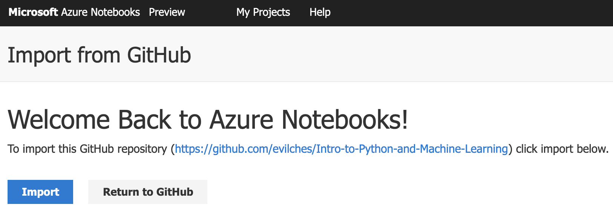
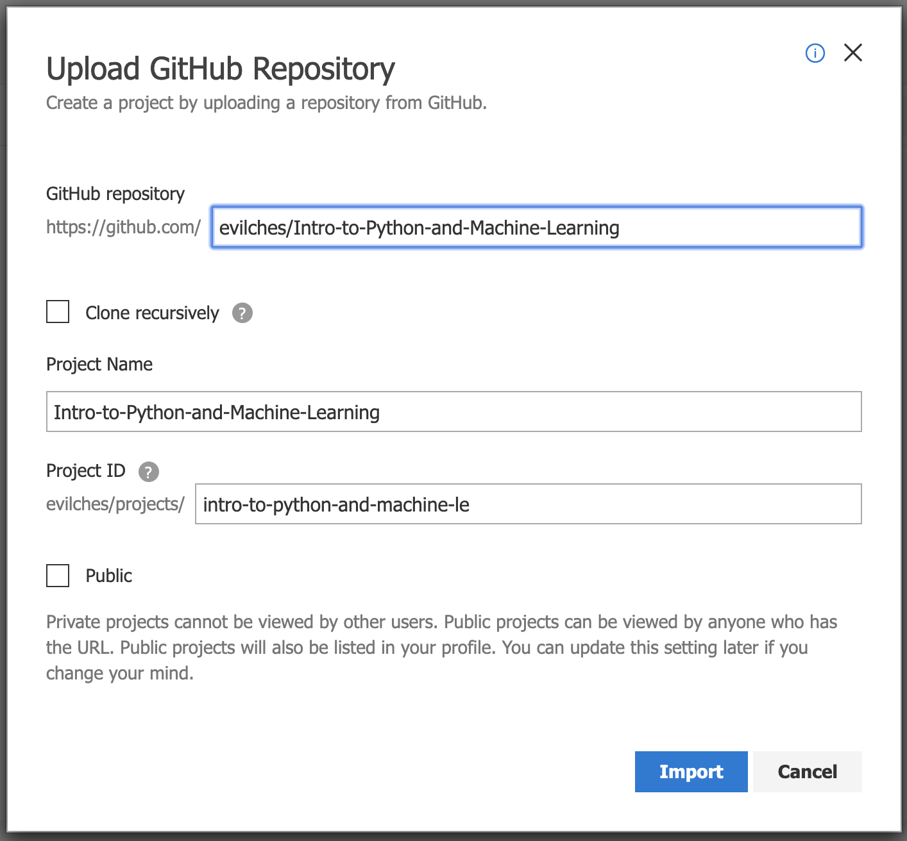
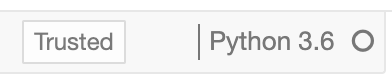

# Introduction to Python, NumPy, pandas, Data Cleaning, Machine Learning and NumbusML
## Try with Azure Notebooks - free Jupyter based notebooks in the Azure cloud

1. 
[Import notebooks ](https://notebooks.azure.com/import/gh/evilches/Intro-to-Python-and-Machine-Learning/) into Azure Notebooks.
    
    
    
2. Open and learn the contents of the notebooks in the following order: 
    - 1_Intro to Python.ipynb
    - 2_Intro to numpy.ipynb
    - 3_Intro to pandas.ipynb
    - 4_Intro to data cleaning.ipynb
    - 5_Intro to Machine Learning.ipynb
    - 6_From Scikit-Learn to NimbusML.ipynb
    - 7_NimbusML LightGBM Regressor.ipynb
    
    **Note: Make sure the Azure Notebook kernel is set to `Python 3.6`** when you open a notebook.  
    
    