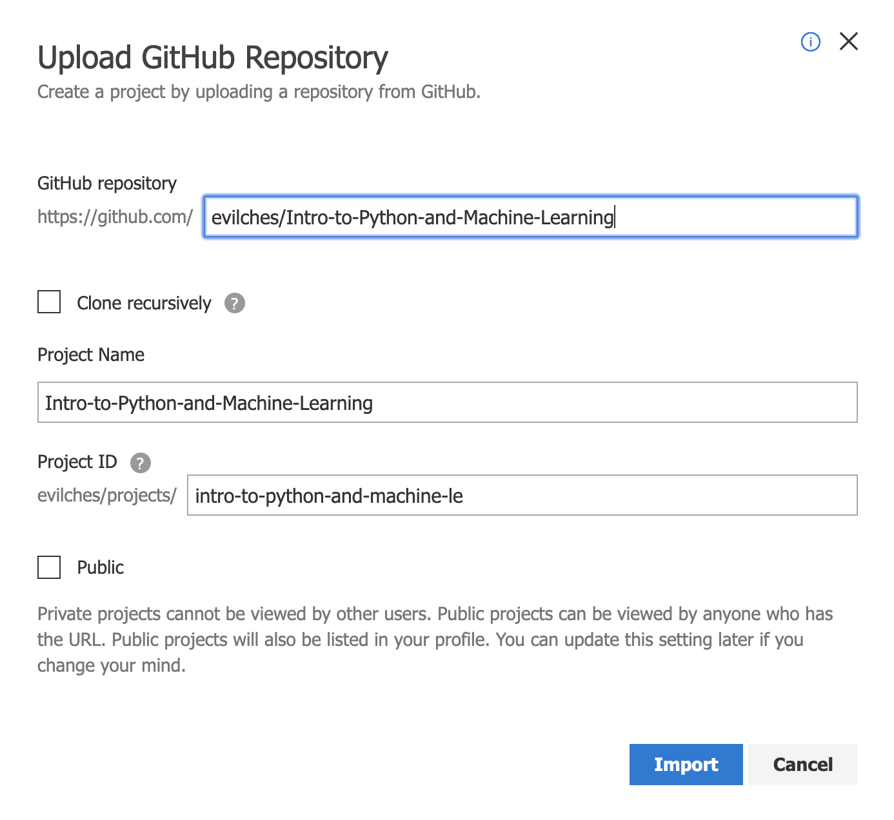
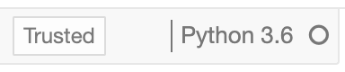

# Introduction to Python and Machine Learning
#### Try with Azure Notebooks - free Jupyter based notebooks in the Azure cloud

 

1. 
[Import notebooks ](https://notebooks.azure.com/import/gh/evilches/Intro-to-Python-and-Machine-Learning/) into Azure Notebooks.   
     
    <table border="3" width="700px"><tr><td>
  	
 	</td></tr></table>  
       
    <table border="3" width="700px"><tr><td>
  	
 	</td></tr></table>  
	 

2. Open and learn the contents of the notebooks in the following order: 
    - 1_Intro to Python.ipynb
    - 2_Intro to numpy.ipynb
    - 3_Intro to pandas.ipynb
    - 4_Intro to data cleaning.ipynb
    - 5_Intro to Machine Learning.ipynb
    - 6_From Scikit-Learn to NimbusML.ipynb
    - 7_Regression Model with NimbusML.ipynb  
    
      
    
    **Note: Make sure the Azure Notebook kernel is set to `Python 3.6`** when you open a notebook.  
    <table border="3" width="150px"><tr><td>
  	
 	</td></tr></table>